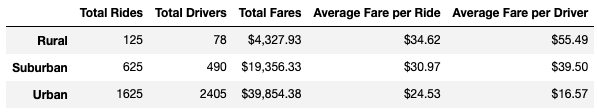
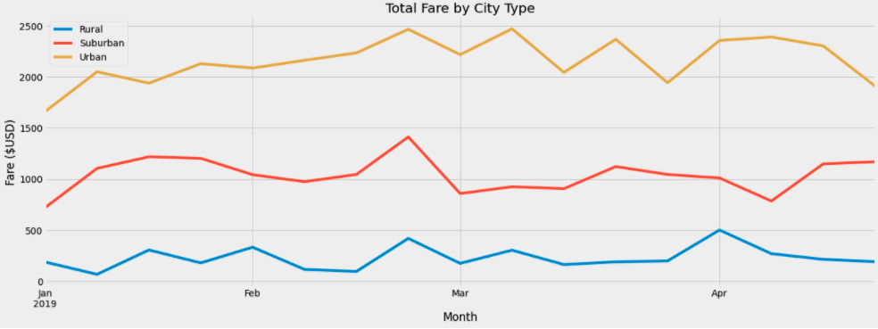

# PyBer Analysis

## Overview of the Analysis

The purpose of this analysis was to gather ride sharing data by city type for our client, Omar. We used Pandas and Matplotlib to create a graph that showed total weekly fares for each city type.

## Results

[Link to PyBer Challenge](https://github.com/SeanDraper/Pyber_Analysis/blob/main/PyBer_Challenge.ipynb)

Above is a link to the PyBer Challenge code.

Above is a screenshot of the PyBer summary data. We used multiple formulas to compile data for each city type based on total rides, total drivers, total fares, average fare per ride, and average fare per driver and compiled them into a single dataframe.

Above is a stacked line chart displaying the total fares per week for each city type between January 1st, 2019 and April 28th, 2019.

The first major difference between city types that is very apparant is the number of rides and drivers for each type. Urban has by far the most rides and drivers, followed by suburban, and finally rural has very few. This has a direct correlation with the total fares since the city type with the most rides will produce the higheset amount of revenue.

We can also see that the further away you are away from the city, the more expensive the average fare per ride is. Rural is the most expensive, followed by suburban, with urban being the cheapest. This is most likely because people in rural areas have to spend more money to go longer distances to get to the city and urban areas. People in urban areas travel shorter distances since it is less likely the majority of their trips go outside the city. This also causes a positive correlation with average fare per driver. Drivers in rural areas will earn more per ride because they have to take riders longer distances.

## Summary

Based on the results that we gathered from this analysis, we have three recommendations to the CEO addressing the disparities between city types.

1. The first reccomendation we have is to incentivize travel in rural areas. Because the fewest number of trips is taken in rural areas, but the average fare is the highest, this is one of the areas that could be improved and in turn gain additional revenue. Riders in rural and suburban areas could be given discounts based on milage to encourage use of ride sharing. For example, trips 3+ miles could be given a 5% discount, and trips 5+ miles could be given a 10% discount.

2. To keep up with the increased demand from our first recommendation, we would need to incentivize drivers to pick up passengers in rural areas. "Hot zones" could be set up in specific rural areas that give drivers increased earnings if they pick up a passenger from a designated area.

3. To account for urban areas having the lowest average fare per ride, we could also apply a discount to urban riders if they travel a certain distance. This would accomplish two goals. First, it would increase the average fare for urban riders, and secondly it would cause more drivers to end up in suburban and rural areas when their ride was complete. This would help us keep up with the demand from implementing discounts based on mileage in suburban and rural areas.